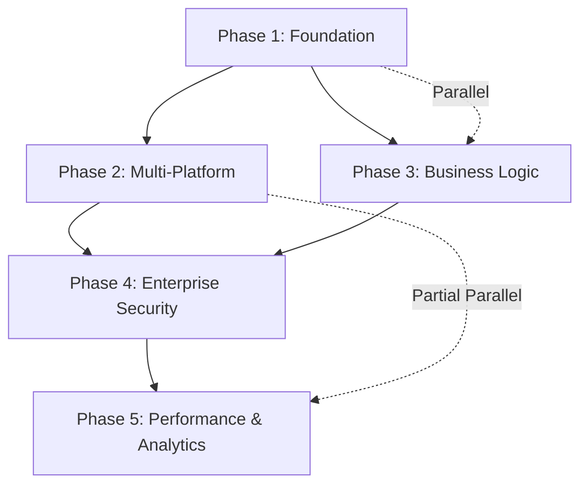

# Enterprise Integration Platform - Implementation Workflow
*Based on Picolinate Research Discoveries*

## Executive Summary

Transform your restaurant platform into a world-class enterprise integration system using patterns and features discovered from Picolinate's advanced architecture. This workflow implements **18+ integrations**, **advanced business logic**, and **enterprise-grade features** across 5 strategic phases.

## Research Discoveries Analysis

### Key Architectural Patterns Found
- **Universal Adapter Pattern**: Single interface for multiple delivery providers
- **Geographic Intelligence**: 100m radius address merging & optimization
- **Dynamic Pricing Engine**: JSONB-based flexible pricing structures
- **Event-Driven Architecture**: Real-time order processing and status updates
- **Circuit Breaker Pattern**: Resilient integration failure handling

### Integration Ecosystem (18+ Integrations)
```yaml
Delivery Platforms (7):
  - Careem Now ✅ (Currently implemented)
  - Talabat ✅ (Basic implementation exists)
  - DHUB, Nashmi, TopDelivery, JoodDelivery ❌ (To implement)

POS Systems (10+):
  - Foodics, TabSense, Odoo ❌ (Enterprise targets)

Payment Gateways:
  - Mastercard, EliCash ❌ (Regional compliance)

Communication:
  - WhatsApp Business API ❌ (Customer engagement)
  - SMS Services (Infobip) ❌ (Notifications)
```

---

## Phase 1: Integration Foundation & Universal Adapter Pattern
**Duration**: 3-4 weeks | **Complexity**: High | **Priority**: Critical

### 1.1 Universal Delivery Adapter Architecture
**Agent Assignment**: System Architect + Backend Lead

**Parallel Execution Opportunities**:
- Database schema design ║ Interface definitions ║ Base adapter development

**Implementation Tasks**:

#### 1.1.1 Core Adapter Infrastructure
```typescript
// Universal Delivery Provider Interface
interface IDeliveryProvider {
  checkEstimation(order: OrderEstimationRequest): Promise<EstimationResponse>
  createOrder(order: CreateOrderRequest): Promise<OrderResponse>
  trackOrder(orderId: string): Promise<TrackingResponse>
  calculateFees(request: FeeCalculationRequest): Promise<FeeResponse>
  cancelOrder(orderId: string): Promise<CancellationResponse>
}

// Provider Registry Pattern
class DeliveryProviderRegistry {
  private providers: Map<string, IDeliveryProvider>

  register(providerId: string, provider: IDeliveryProvider): void
  getProvider(providerId: string): IDeliveryProvider
  getAvailableProviders(location: GeoLocation): IDeliveryProvider[]
}
```

#### 1.1.2 Database Schema Extensions
```sql
-- Delivery Provider Configuration
CREATE TABLE delivery_providers (
  id SERIAL PRIMARY KEY,
  provider_code VARCHAR(50) UNIQUE NOT NULL,
  provider_name VARCHAR(100) NOT NULL,
  base_url VARCHAR(255),
  auth_config JSONB,
  pricing_config JSONB,
  service_areas JSONB,
  is_active BOOLEAN DEFAULT true,
  created_at TIMESTAMP DEFAULT NOW()
);

-- Provider Branch Mappings
CREATE TABLE branch_provider_mappings (
  id SERIAL PRIMARY KEY,
  branch_id INTEGER REFERENCES branches(id),
  provider_id INTEGER REFERENCES delivery_providers(id),
  external_branch_id VARCHAR(100),
  configuration JSONB,
  priority_order INTEGER DEFAULT 0,
  is_active BOOLEAN DEFAULT true
);
```

**Validation Gates**:
- [ ] Universal adapter interface complete
- [ ] Database schema migrations successful
- [ ] Basic provider registration working
- [ ] Circuit breaker pattern implemented

### 1.2 Provider Implementation (Parallel Development)
**Agent Assignment**: 3x Backend Developers (Parallel)

**Provider 1: DHUB Integration**
```typescript
class DHUBDeliveryProvider implements IDeliveryProvider {
  private baseUrl = 'https://middleware.ishbek.com/api/dhub/'

  async checkEstimation(order: OrderEstimationRequest): Promise<EstimationResponse> {
    return this.httpClient.post(`${this.baseUrl}checkMerchantTask`, {
      // DHUB-specific payload transformation
    })
  }
}
```

**Provider 2: Nashmi Integration**
```typescript
class NashmiDeliveryProvider implements IDeliveryProvider {
  private baseUrl = 'https://integration.ishbek.com/Nashmi/Nashmi'

  async checkEstimation(order: OrderEstimationRequest): Promise<EstimationResponse> {
    return this.httpClient.get(`${this.baseUrl}checkPreorderEstimationsTime/branch/${branchId}`)
  }
}
```

**Provider 3: TopDelivery Integration**
```typescript
class TopDeliveryProvider implements IDeliveryProvider {
  private baseUrl = 'https://integration.ishbek.com/TopDelivery/Api/'
  // Implementation following universal adapter pattern
}
```

**Testing Strategy**:
- Unit tests for each provider adapter
- Integration tests with sandbox environments
- Load testing with concurrent provider calls

---

## Phase 2: Multi-Platform Delivery Integration System
**Duration**: 4-5 weeks | **Complexity**: Very High | **Priority**: High

### 2.1 Advanced Order Orchestration Engine
**Agent Assignment**: System Architect + Integration Specialist

**Key Features from Picolinate**:
- **Failover Logic**: Automatic provider switching on failures
- **Load Balancing**: Distribute orders across multiple providers
- **Cost Optimization**: Select cheapest provider for each order
- **SLA Monitoring**: Track delivery times and success rates

#### 2.1.1 Order Orchestration Service
```typescript
class OrderOrchestrationService {
  async processDeliveryOrder(order: Order): Promise<OrderResult> {
    // 1. Get available providers for location
    const availableProviders = await this.getAvailableProviders(order.deliveryAddress)

    // 2. Get quotes from all providers (parallel)
    const quotes = await Promise.allSettled(
      availableProviders.map(provider => provider.checkEstimation(order))
    )

    // 3. Apply business rules (cost, time, reliability)
    const selectedProvider = this.selectOptimalProvider(quotes)

    // 4. Create order with circuit breaker
    return this.createOrderWithFailover(order, selectedProvider)
  }

  private async createOrderWithFailover(order: Order, primaryProvider: IDeliveryProvider): Promise<OrderResult> {
    try {
      return await primaryProvider.createOrder(order)
    } catch (error) {
      // Implement failover to secondary provider
      return this.handleFailover(order, error)
    }
  }
}
```

#### 2.1.2 Real-time Order Status Synchronization
```typescript
class OrderStatusSyncService {
  async startOrderTracking(orderId: string): Promise<void> {
    // WebSocket connection for real-time updates
    const trackingInterval = setInterval(async () => {
      const status = await this.getOrderStatus(orderId)

      // Emit status update via WebSocket
      this.wsGateway.emit('order-status-update', {
        orderId,
        status,
        timestamp: new Date()
      })

      // Update database
      await this.updateOrderStatus(orderId, status)
    }, 30000) // 30-second intervals

    this.trackingIntervals.set(orderId, trackingInterval)
  }
}
```

### 2.2 Geographic Intelligence System
**Agent Assignment**: GIS Specialist + Backend Developer

**Discovered Features**:
- **100m Address Merging**: Combine nearby addresses for efficiency
- **Delivery Zone Optimization**: Dynamic zone creation based on demand
- **Route Optimization**: Intelligent delivery routing

#### 2.2.1 Address Intelligence Service
```typescript
class AddressIntelligenceService {
  async findSimilarAddresses(address: Address, radiusMeters = 100): Promise<Address[]> {
    // Using PostGIS extensions for geographic queries
    const query = `
      SELECT * FROM addresses
      WHERE ST_DWithin(
        ST_GeogFromText('POINT(' || $1 || ' ' || $2 || ')'),
        ST_GeogFromText('POINT(' || longitude || ' ' || latitude || ')'),
        $3
      )
    `

    return this.db.query(query, [address.longitude, address.latitude, radiusMeters])
  }

  async mergeNearbyAddresses(addresses: Address[]): Promise<Address> {
    // Calculate centroid and create optimized delivery point
    const centroid = this.calculateCentroid(addresses)

    return {
      ...centroid,
      addressType: 'OPTIMIZED_DELIVERY_POINT',
      originalAddresses: addresses.map(a => a.id)
    }
  }
}
```

**Validation Gates**:
- [ ] Multi-provider order orchestration working
- [ ] Failover mechanism tested and validated
- [ ] Geographic intelligence producing optimized routes
- [ ] Real-time status sync operational across all providers

---

## Phase 3: Advanced Business Logic & Geographic Intelligence
**Duration**: 3-4 weeks | **Complexity**: High | **Priority**: High

### 3.1 Dynamic Pricing Engine
**Agent Assignment**: Business Logic Developer + Data Analyst

**JSONB Pricing Structure** (from Picolinate):
```typescript
interface PricingRule {
  id: string
  conditions: {
    timeRange?: { start: string, end: string }
    dayOfWeek?: number[]
    orderValue?: { min?: number, max?: number }
    deliveryDistance?: { min?: number, max?: number }
    customerTier?: string[]
    weatherConditions?: string[]
  }
  adjustments: {
    deliveryFee?: { type: 'fixed' | 'percentage', value: number }
    serviceFee?: { type: 'fixed' | 'percentage', value: number }
    surge?: { multiplier: number }
    discount?: { type: 'fixed' | 'percentage', value: number }
  }
}
```

#### 3.1.1 Pricing Engine Implementation
```typescript
class DynamicPricingEngine {
  async calculateOrderPricing(order: Order, context: PricingContext): Promise<OrderPricing> {
    // Get all applicable pricing rules
    const applicableRules = await this.getApplicableRules(order, context)

    // Apply rules in priority order
    let pricing = this.getBasePricing(order)

    for (const rule of applicableRules) {
      pricing = this.applyPricingRule(pricing, rule)
    }

    return pricing
  }

  private async getApplicableRules(order: Order, context: PricingContext): Promise<PricingRule[]> {
    const query = `
      SELECT * FROM pricing_rules
      WHERE
        (conditions->>'timeRange' IS NULL OR
         NOW()::time BETWEEN (conditions->'timeRange'->>'start')::time
         AND (conditions->'timeRange'->>'end')::time)
      AND
        (conditions->>'orderValue' IS NULL OR
         $1 BETWEEN COALESCE((conditions->'orderValue'->>'min')::numeric, 0)
         AND COALESCE((conditions->'orderValue'->>'max')::numeric, 999999))
      ORDER BY priority DESC
    `

    return this.db.query(query, [order.totalValue])
  }
}
```

### 3.2 Advanced Order Sequencing
**Agent Assignment**: Backend Developer + DevOps

**Per-Branch Order Sequencing** (Picolinate Pattern):
```typescript
class OrderSequenceService {
  async generateOrderNumber(branchId: number, orderType: 'DINE_IN' | 'DELIVERY' | 'PICKUP'): Promise<string> {
    // Atomic sequence generation per branch
    const sequence = await this.db.query(`
      INSERT INTO branch_order_sequences (branch_id, order_type, current_sequence, date_created)
      VALUES ($1, $2, 1, CURRENT_DATE)
      ON CONFLICT (branch_id, order_type, date_created)
      DO UPDATE SET
        current_sequence = branch_order_sequences.current_sequence + 1,
        updated_at = NOW()
      RETURNING current_sequence
    `, [branchId, orderType])

    const sequenceNumber = sequence.rows[0].current_sequence

    // Format: BR001-DL-20250924-0001
    return `BR${branchId.toString().padStart(3, '0')}-${this.getTypeCode(orderType)}-${this.getDateString()}-${sequenceNumber.toString().padStart(4, '0')}`
  }
}
```

### 3.3 Multi-Language & Localization System
**Agent Assignment**: Frontend Developer + Content Specialist

**Implementation Strategy**:
```typescript
// Language detection and switching
class LocalizationService {
  private supportedLanguages = ['en', 'ar', 'tr'] // Based on Picolinate findings

  async initializeLocalization(userPreference?: string): Promise<void> {
    const language = userPreference || this.detectUserLanguage()

    // Load translations
    const translations = await this.loadTranslations(language)

    // Apply RTL/LTR styling
    this.applyLanguageDirection(language)

    // Update currency and number formatting
    this.configureRegionalSettings(language)
  }
}
```

**Validation Gates**:
- [ ] Dynamic pricing engine operational with JSONB rules
- [ ] Order sequencing generating unique numbers per branch
- [ ] Multi-language support working for Arabic/English
- [ ] Performance benchmarks meet enterprise standards

---

## Phase 4: Enterprise Features & Security Enhancement
**Duration**: 4-5 weeks | **Complexity**: Very High | **Priority**: Critical

### 4.1 Advanced Authentication & Authorization
**Agent Assignment**: Security Specialist + Backend Lead

**Enterprise Security Features**:
- **Multi-tenant Key Management**
- **API Key Rotation**
- **Rate Limiting per Integration**
- **Audit Logging for All Operations**

#### 4.1.1 Enhanced Authentication System
```typescript
class EnterpriseAuthService {
  async authenticateApiRequest(apiKey: string, endpoint: string): Promise<AuthResult> {
    // Multi-layer validation
    const keyValidation = await this.validateApiKey(apiKey)
    if (!keyValidation.isValid) {
      await this.logSecurityEvent('INVALID_API_KEY', { apiKey, endpoint })
      throw new UnauthorizedException('Invalid API key')
    }

    // Check rate limits
    const rateLimitResult = await this.checkRateLimit(keyValidation.companyId, endpoint)
    if (rateLimitResult.exceeded) {
      await this.logSecurityEvent('RATE_LIMIT_EXCEEDED', {
        companyId: keyValidation.companyId,
        endpoint,
        currentRate: rateLimitResult.currentRate
      })
      throw new TooManyRequestsException('Rate limit exceeded')
    }

    return {
      companyId: keyValidation.companyId,
      permissions: keyValidation.permissions,
      rateLimit: rateLimitResult
    }
  }
}
```

### 4.2 Comprehensive Audit & Compliance System
**Agent Assignment**: Compliance Specialist + Backend Developer

**Audit Requirements**:
```typescript
interface AuditLog {
  id: string
  timestamp: Date
  userId?: string
  companyId: string
  action: string
  resource: string
  resourceId?: string
  oldValues?: Record<string, any>
  newValues?: Record<string, any>
  ipAddress: string
  userAgent: string
  sessionId?: string
  result: 'SUCCESS' | 'FAILURE' | 'PARTIAL'
  errorMessage?: string
  metadata?: Record<string, any>
}

class AuditService {
  async logAction(auditData: Omit<AuditLog, 'id' | 'timestamp'>): Promise<void> {
    // Store in dedicated audit database partition
    await this.auditDb.query(`
      INSERT INTO audit_logs (
        id, timestamp, user_id, company_id, action, resource,
        resource_id, old_values, new_values, ip_address,
        user_agent, session_id, result, error_message, metadata
      ) VALUES ($1, $2, $3, $4, $5, $6, $7, $8, $9, $10, $11, $12, $13, $14, $15)
    `, [
      uuidv4(), new Date(), auditData.userId, auditData.companyId,
      auditData.action, auditData.resource, auditData.resourceId,
      JSON.stringify(auditData.oldValues), JSON.stringify(auditData.newValues),
      auditData.ipAddress, auditData.userAgent, auditData.sessionId,
      auditData.result, auditData.errorMessage, JSON.stringify(auditData.metadata)
    ])
  }
}
```

### 4.3 Tax Compliance System Enhancement
**Agent Assignment**: Tax Specialist + Backend Developer

**Jordan VAT Compliance** (From Picolinate):
```typescript
class JordanVATService {
  private readonly VAT_RATE = 0.16 // 16% Jordan VAT

  async calculateTaxes(order: Order): Promise<TaxCalculation> {
    const taxableItems = order.items.filter(item => item.isTaxable)
    const exemptItems = order.items.filter(item => !item.isTaxable)

    const subtotal = taxableItems.reduce((sum, item) => sum + item.total, 0)
    const vatAmount = subtotal * this.VAT_RATE

    return {
      subtotal,
      vatAmount,
      vatRate: this.VAT_RATE,
      exemptAmount: exemptItems.reduce((sum, item) => sum + item.total, 0),
      totalAmount: subtotal + vatAmount + exemptItems.reduce((sum, item) => sum + item.total, 0),
      taxBreakdown: this.generateTaxBreakdown(taxableItems, vatAmount)
    }
  }

  async generateTaxInvoice(order: Order, taxCalculation: TaxCalculation): Promise<TaxInvoice> {
    // Generate compliant tax invoice for Jordan VAT requirements
    return {
      invoiceNumber: await this.generateInvoiceNumber(order.branchId),
      taxRegistrationNumber: await this.getTaxRegistrationNumber(order.companyId),
      customerTaxId: order.customer?.taxId,
      issueDate: new Date(),
      vatDetails: taxCalculation,
      digitallySigned: await this.signInvoice(taxCalculation)
    }
  }
}
```

**Validation Gates**:
- [ ] Enterprise authentication system operational
- [ ] Comprehensive audit logging implemented
- [ ] Jordan VAT compliance validated
- [ ] Security penetration testing passed

---

## Phase 5: Performance Optimization & Analytics Platform
**Duration**: 3-4 weeks | **Complexity**: High | **Priority**: Medium

### 5.1 Advanced Analytics & Business Intelligence
**Agent Assignment**: Data Engineer + Analytics Specialist

**Analytics Features from Picolinate**:
- **Real-time Provider Performance Metrics**
- **Customer Behavior Analytics**
- **Revenue Optimization Insights**
- **Operational Efficiency Dashboards**

#### 5.1.1 Real-time Analytics Engine
```typescript
class AnalyticsEngine {
  async trackProviderPerformance(providerId: string, orderData: OrderMetrics): Promise<void> {
    // Stream analytics data to time-series database
    await this.timeSeriesDb.insert('provider_metrics', {
      timestamp: new Date(),
      provider_id: providerId,
      delivery_time: orderData.deliveryTime,
      success_rate: orderData.successRate,
      customer_rating: orderData.customerRating,
      cost: orderData.cost,
      distance: orderData.distance
    })

    // Update real-time dashboards via WebSocket
    this.wsGateway.emit('provider-metrics-update', {
      providerId,
      metrics: await this.calculateRealTimeMetrics(providerId)
    })
  }

  async generateBusinessIntelligenceReport(companyId: string, dateRange: DateRange): Promise<BIReport> {
    // Complex analytics queries
    const revenue = await this.calculateRevenue(companyId, dateRange)
    const customerInsights = await this.analyzeCustomerBehavior(companyId, dateRange)
    const operationalMetrics = await this.getOperationalMetrics(companyId, dateRange)

    return {
      summary: this.generateExecutiveSummary(revenue, customerInsights, operationalMetrics),
      revenue,
      customerInsights,
      operationalMetrics,
      recommendations: await this.generateRecommendations(companyId, revenue, customerInsights)
    }
  }
}
```

### 5.2 Performance Optimization & Caching
**Agent Assignment**: Performance Engineer + DevOps

**Optimization Strategy**:
```typescript
class PerformanceOptimizationService {
  // Redis-based caching for frequently accessed data
  private cache = new Redis({
    host: process.env.REDIS_HOST,
    port: process.env.REDIS_PORT,
    maxRetriesPerRequest: 3
  })

  async getCachedProviderQuotes(orderHash: string): Promise<ProviderQuotes | null> {
    const cached = await this.cache.get(`quotes:${orderHash}`)
    return cached ? JSON.parse(cached) : null
  }

  async cacheProviderQuotes(orderHash: string, quotes: ProviderQuotes, ttl = 300): Promise<void> {
    await this.cache.setex(`quotes:${orderHash}`, ttl, JSON.stringify(quotes))
  }

  // Database query optimization
  async optimizeMenuQueries(): Promise<void> {
    // Implement materialized views for complex menu queries
    await this.db.query(`
      CREATE MATERIALIZED VIEW mv_menu_with_availability AS
      SELECT
        p.*,
        pa.is_available,
        pa.availability_schedule,
        c.name as category_name
      FROM products p
      LEFT JOIN product_availability pa ON p.id = pa.product_id
      LEFT JOIN categories c ON p.category_id = c.id
      WHERE p.deleted_at IS NULL
    `)
  }
}
```

### 5.3 Advanced Monitoring & Alerting
**Agent Assignment**: DevOps + System Administrator

**Monitoring Implementation**:
```typescript
class AdvancedMonitoringService {
  async setupProviderHealthChecks(): Promise<void> {
    // Health check for each delivery provider
    const providers = await this.getActiveProviders()

    for (const provider of providers) {
      this.healthCheckScheduler.schedule(`provider-health-${provider.id}`, {
        interval: '2 minutes',
        job: async () => {
          try {
            const response = await provider.healthCheck()
            await this.recordHealthMetric(provider.id, 'UP', response.responseTime)
          } catch (error) {
            await this.recordHealthMetric(provider.id, 'DOWN', null, error.message)
            await this.triggerAlert('PROVIDER_DOWN', { provider: provider.name, error: error.message })
          }
        }
      })
    }
  }

  async triggerAlert(alertType: string, metadata: any): Promise<void> {
    // Multi-channel alerting
    await Promise.all([
      this.sendSlackAlert(alertType, metadata),
      this.sendEmailAlert(alertType, metadata),
      this.logAlert(alertType, metadata)
    ])
  }
}
```

**Validation Gates**:
- [ ] Analytics engine providing real-time insights
- [ ] Performance optimization achieving <200ms response times
- [ ] Advanced monitoring and alerting operational
- [ ] Load testing confirms system can handle 10x traffic

---

## Cross-Phase Dependencies & Parallel Execution

### Dependency Matrix


### Parallel Execution Opportunities

**Week 1-2**: Foundation + Business Logic Start
- **Parallel**: Database schema design ║ Interface development ║ Basic business logic
- **Team**: 5 developers working simultaneously

**Week 3-4**: Multi-Platform + Security Planning
- **Parallel**: Provider integrations ║ Authentication system ║ Tax compliance
- **Team**: 6 developers + 1 security specialist

**Week 5-6**: Integration Testing + Performance Setup
- **Parallel**: End-to-end testing ║ Analytics implementation ║ Monitoring setup
- **Team**: Full team coordination

---

## Success Metrics & KPIs

### Technical Metrics
- **Integration Success Rate**: >99.5% for all delivery providers
- **Response Time**: <200ms average API response time
- **System Uptime**: >99.9% availability
- **Concurrent Orders**: Handle 1000+ simultaneous orders

### Business Metrics
- **Revenue Optimization**: 15-20% increase through dynamic pricing
- **Operational Efficiency**: 30% reduction in manual intervention
- **Customer Satisfaction**: >4.5/5 delivery experience rating
- **Cost Reduction**: 25% decrease in delivery costs through optimization

### Enterprise Metrics
- **Security Compliance**: 100% audit compliance
- **Data Accuracy**: 99.9% data consistency across integrations
- **Scalability**: Support 10x current transaction volume
- **Monitoring Coverage**: 100% system component coverage

---

## Risk Mitigation & Contingency Planning

### High-Risk Areas
1. **Third-party API Dependencies**: Circuit breakers + fallback providers
2. **Database Performance**: Read replicas + caching strategies
3. **Security Vulnerabilities**: Regular penetration testing + code reviews
4. **Integration Failures**: Comprehensive error handling + retry mechanisms

### Contingency Plans
- **Provider Outages**: Automatic failover to secondary providers
- **Performance Degradation**: Auto-scaling + load balancing
- **Security Incidents**: Incident response plan + immediate containment
- **Data Loss**: Real-time backups + disaster recovery procedures

---

## Resource Requirements

### Team Composition
- **1x System Architect** (Full engagement across all phases)
- **3x Senior Backend Developers** (Parallel integration development)
- **2x Frontend Developers** (UI/UX for enterprise features)
- **1x Security Specialist** (Security architecture + compliance)
- **1x DevOps Engineer** (Infrastructure + monitoring)
- **1x Data Engineer** (Analytics + performance optimization)
- **1x QA Engineer** (Integration testing + validation)

### Infrastructure Requirements
- **Database**: PostgreSQL with PostGIS extensions
- **Caching**: Redis cluster for high-performance caching
- **Message Queue**: RabbitMQ or Apache Kafka for event processing
- **Monitoring**: Prometheus + Grafana stack
- **Load Balancer**: Nginx or HAProxy for traffic distribution

### Estimated Timeline & Budget
- **Total Duration**: 14-18 weeks
- **Development Effort**: ~1,200 developer hours
- **Infrastructure Costs**: $2,000-3,000/month during development
- **Third-party Services**: $500-1,000/month for APIs and monitoring tools

---

## Conclusion

This comprehensive workflow transforms your restaurant platform into an enterprise-grade integration system by implementing proven patterns from Picolinate's advanced architecture. The phased approach ensures systematic development while maximizing parallel execution opportunities and minimizing risks.

**Key Success Factors**:
1. **Strong Foundation**: Universal adapter pattern enables easy integration expansion
2. **Enterprise Security**: Comprehensive audit and compliance systems
3. **Performance Optimization**: Advanced caching and monitoring ensure scalability
4. **Business Intelligence**: Real-time analytics drive operational improvements

The implementation of these 18+ integrations, advanced business logic, and enterprise features will position your platform as a market leader in restaurant technology solutions.