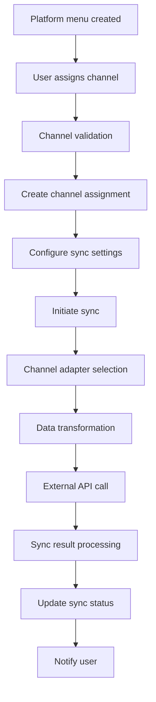
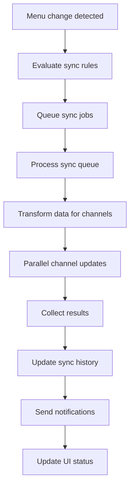

# Ultra-Deep Analysis & Architectural Planning
## Restaurant Platform Menu Management System

**Date**: September 21, 2025
**Analysis Scope**: Complex restaurant platform menu management with category bulk selection and channel assignment
**Target**: Production-ready enterprise system architecture

---

## 🎯 EXECUTIVE SUMMARY

### Current State Assessment
The existing system has a solid foundation with:
- **Frontend**: Next.js with React Query and dual-pane drag-and-drop interface
- **Backend**: NestJS with comprehensive platform menu management
- **Database**: PostgreSQL with multi-tenant platform menu architecture
- **Architecture**: Enterprise-grade multi-tenant with role-based access control

### Critical Requirements Analysis
1. **Category Bulk Selection System**: Add ability to select entire categories for bulk product assignment
2. **UI Enhancement**: Fix visual appearance and improve 2-column grid performance
3. **Channel Assignment System**: Platform-to-delivery-channel mapping with synchronization
4. **Database Schema Extensions**: Support for bulk operations and channel assignments

---

## 🏗️ COMPREHENSIVE ARCHITECTURE ANALYSIS

### 1. Current Menu Builder Architecture

#### Frontend Components Analysis
```typescript
// Current Architecture: MenuProductSelectionUI.tsx
┌─────────────────────────────────────────────────────────┐
│                  MenuProductSelectionUI                 │
├─────────────────────┬───────────────────────────────────┤
│   Left Pane         │         Right Pane                │
│   (Available)       │         (Assigned)                │
│ - Filter bar        │ - Filter bar                      │
│ - 2-column grid     │ - 2-column grid                   │
│ - Drag source       │ - Drop target                     │
│ - Individual add    │ - Individual remove               │
└─────────────────────┴───────────────────────────────────┘

// Hook: useMenuProductSelection.ts
├── React Query integration
├── Optimistic updates
├── Cache management
├── Error handling
└── Bulk operations support (EXISTS)
```

#### Backend Service Architecture
```typescript
// Current Backend: platform-menus.backup/
┌─────────────────────────────────────────────────────────┐
│              Platform Menu Services                     │
├─────────────────────┬───────────────────────────────────┤
│ PlatformMenusService│ MultiPlatformSyncService          │
│ - CRUD operations   │ - Parallel sync engine             │
│ - Bulk add items    │ - Progress monitoring              │
│ - Cache management  │ - Error recovery                   │
│ - Multi-tenant      │ - Performance optimization        │
└─────────────────────┴───────────────────────────────────┘

// Database Schema Analysis
├── PlatformMenu (main menu entity)
├── PlatformMenuItem (product assignments)
├── PlatformMenuCategory (category organization)
├── MenuSyncHistory (audit trails)
└── Multi-tenant isolation via companyId
```

### 2. Gap Analysis & Requirements Mapping

#### Missing Category Bulk Selection
**Current**: Individual product selection only
**Required**: Category-level bulk selection with ALL products from category
```typescript
// Missing Interface
interface CategoryBulkSelection {
  categoryId: string;
  selectAll: boolean;
  productIds: string[]; // All products in category
  excludedProductIds?: string[]; // Selective exclusion
}
```

#### Missing Channel Assignment System
**Current**: Platform menus without delivery channel mapping
**Required**: Platform → Channel assignment with sync capabilities
```typescript
// Missing Channel Assignment Schema
interface ChannelAssignment {
  platformMenuId: string;
  deliveryChannel: 'talabat' | 'careem' | 'website' | 'call_center';
  isActive: boolean;
  syncConfig: ChannelSyncConfig;
}
```

#### UI Enhancement Requirements
**Current Issues**:
- Empty placeholder boxes in 2x3 grid layout
- Missing product image display
- Suboptimal visual hierarchy

**Required Improvements**:
- Professional product card design
- Optimized image loading
- Enhanced filtering UX
- Category selection UI components

---

## 🛠️ SYSTEM ARCHITECTURE DESIGN

### 1. Category Bulk Selection System Architecture

#### Frontend Architecture
```typescript
// Enhanced MenuProductSelectionUI Component
interface CategoryBulkSelectionProps {
  categories: MenuCategory[];
  onCategorySelect: (categoryId: string, selectAll: boolean) => void;
  onCategoryBulkAdd: (categoryId: string, productIds: string[]) => Promise<void>;
  selectedCategories: Map<string, CategorySelection>;
}

interface CategorySelection {
  categoryId: string;
  isSelected: boolean;
  totalProducts: number;
  selectedProducts: string[];
  excludedProducts: string[];
}

// New Component: CategoryBulkSelector
┌─────────────────────────────────────────────────────────┐
│              CategoryBulkSelector                       │
├─────────────────────────────────────────────────────────┤
│ [✓] Appetizers (12 products) [Select All] [Add All]    │
│ [✓] Main Courses (24 products) [Select All] [Add All]  │
│ [ ] Desserts (8 products) [Select All] [Add All]       │
│ [ ] Beverages (15 products) [Select All] [Add All]     │
└─────────────────────────────────────────────────────────┘
```

#### Backend API Design
```typescript
// Enhanced Menu Controller
@Controller('menu')
export class MenuController {
  // Bulk category operations
  @Post('platforms/:platformId/categories/bulk-add')
  async bulkAddCategoryProducts(
    @Param('platformId') platformId: string,
    @Body() bulkCategoryDto: BulkCategoryOperationDto,
    @Request() req
  ): Promise<BulkOperationResult> {
    return this.menuService.bulkAddCategoryProducts(
      platformId,
      bulkCategoryDto,
      req.user.companyId,
      req.user.id
    );
  }

  @Get('categories/:categoryId/products')
  async getCategoryProducts(
    @Param('categoryId') categoryId: string,
    @Query() filters: CategoryProductFilters,
    @Request() req
  ): Promise<CategoryProductsResponse> {
    return this.menuService.getCategoryProducts(
      categoryId,
      filters,
      req.user.companyId
    );
  }
}

// New DTO
export interface BulkCategoryOperationDto {
  categoryIds: string[];
  operation: 'add' | 'remove';
  selectAll: boolean;
  excludedProductIds?: string[];
  platformSpecificConfig?: PlatformItemConfig;
}
```

#### Database Schema Extensions
```sql
-- Category bulk operation tracking
CREATE TABLE category_bulk_operations (
  id UUID PRIMARY KEY DEFAULT gen_random_uuid(),
  platform_menu_id UUID NOT NULL REFERENCES platform_menus(id),
  category_id UUID NOT NULL REFERENCES menu_categories(id),
  operation_type VARCHAR(20) NOT NULL, -- 'add_all', 'remove_all', 'selective'
  products_added INT DEFAULT 0,
  products_excluded TEXT[], -- Array of excluded product IDs
  created_by UUID REFERENCES users(id),
  created_at TIMESTAMP DEFAULT NOW(),
  completed_at TIMESTAMP,

  INDEX idx_category_bulk_platform (platform_menu_id),
  INDEX idx_category_bulk_category (category_id),
  INDEX idx_category_bulk_operation (operation_type, created_at)
);

-- Enhanced platform menu items for bulk tracking
ALTER TABLE platform_menu_items ADD COLUMN added_via_bulk_operation UUID
  REFERENCES category_bulk_operations(id);
ALTER TABLE platform_menu_items ADD COLUMN bulk_operation_metadata JSONB DEFAULT '{}';
```

### 2. Channel Assignment & Synchronization System

#### Channel Assignment Architecture
```typescript
// New Channel Assignment System
interface ChannelAssignment {
  id: string;
  platformMenuId: string;
  deliveryChannel: DeliveryChannel;
  isActive: boolean;
  syncConfig: ChannelSyncConfig;
  lastSyncedAt?: Date;
  syncStatus: 'pending' | 'syncing' | 'completed' | 'failed';
  externalChannelId?: string; // Platform-specific ID
  createdAt: Date;
  updatedAt: Date;
}

interface ChannelSyncConfig {
  autoSync: boolean;
  syncFrequency: number; // minutes
  syncEvents: SyncEvent[]; // 'product_update', 'price_change', 'availability_change'
  retryConfig: RetryConfig;
  transformationRules: TransformationRule[];
}

// Channel-specific adapters
abstract class ChannelAdapter {
  abstract syncMenu(menuData: PlatformMenuData): Promise<ChannelSyncResult>;
  abstract getMenuStatus(externalMenuId: string): Promise<ChannelMenuStatus>;
  abstract transformMenuData(menuData: PlatformMenuData): ChannelSpecificData;
}

class TalabatChannelAdapter extends ChannelAdapter {
  async syncMenu(menuData: PlatformMenuData): Promise<ChannelSyncResult> {
    // Talabat-specific menu synchronization
    const transformedData = this.transformMenuData(menuData);
    const syncResult = await this.talabatApiClient.updateMenu(transformedData);
    return this.formatSyncResult(syncResult);
  }
}
```

#### Database Schema for Channel Assignment
```sql
-- Channel assignment table
CREATE TABLE channel_assignments (
  id UUID PRIMARY KEY DEFAULT gen_random_uuid(),
  platform_menu_id UUID NOT NULL REFERENCES platform_menus(id),
  delivery_channel VARCHAR(50) NOT NULL,
  is_active BOOLEAN DEFAULT true,
  sync_config JSONB DEFAULT '{}',
  last_synced_at TIMESTAMP,
  sync_status VARCHAR(20) DEFAULT 'pending',
  external_channel_id VARCHAR(255),
  external_menu_id VARCHAR(255),
  company_id UUID NOT NULL REFERENCES companies(id),
  created_at TIMESTAMP DEFAULT NOW(),
  updated_at TIMESTAMP DEFAULT NOW(),
  created_by UUID REFERENCES users(id),
  updated_by UUID REFERENCES users(id),

  UNIQUE(platform_menu_id, delivery_channel),
  INDEX idx_channel_assignments_platform (platform_menu_id),
  INDEX idx_channel_assignments_channel (delivery_channel),
  INDEX idx_channel_assignments_company (company_id),
  INDEX idx_channel_assignments_sync_status (sync_status, last_synced_at)
);

-- Channel sync history
CREATE TABLE channel_sync_history (
  id UUID PRIMARY KEY DEFAULT gen_random_uuid(),
  channel_assignment_id UUID NOT NULL REFERENCES channel_assignments(id),
  sync_type VARCHAR(50) NOT NULL, -- 'full', 'incremental', 'products', 'prices'
  sync_status VARCHAR(20) NOT NULL,
  items_synced INT DEFAULT 0,
  items_failed INT DEFAULT 0,
  sync_duration_ms INT,
  error_message TEXT,
  error_details JSONB,
  external_response JSONB,
  started_at TIMESTAMP DEFAULT NOW(),
  completed_at TIMESTAMP,
  initiated_by UUID REFERENCES users(id),

  INDEX idx_channel_sync_assignment (channel_assignment_id),
  INDEX idx_channel_sync_status (sync_status, started_at),
  INDEX idx_channel_sync_type (sync_type, started_at)
);
```

### 3. Enhanced UI Architecture

#### Component Hierarchy
```typescript
// Enhanced Component Structure
MenuProductSelectionUI/
├── CategoryBulkSelector/
│   ├── CategoryCard/
│   │   ├── CategoryHeader
│   │   ├── ProductCount
│   │   ├── BulkActionButtons
│   │   └── SelectionIndicator
│   └── BulkActionPanel/
│       ├── SelectAllButton
│       ├── AddAllButton
│       └── ProgressIndicator
├── ProductGrid/ (Enhanced)
│   ├── ProductCard/ (Redesigned)
│   │   ├── ProductImage (Optimized)
│   │   ├── ProductInfo
│   │   ├── PriceDisplay
│   │   ├── ActionButtons
│   │   └── DragHandle
│   └── GridVirtualization
├── FilterBar/ (Enhanced)
│   ├── SearchInput
│   ├── CategoryFilter (with bulk select)
│   ├── StatusFilter
│   └── SortOptions
└── ChannelAssignmentPanel/ (New)
    ├── ChannelSelector
    ├── SyncConfiguration
    ├── SyncStatus
    └── SyncHistory
```

#### Performance Optimizations
```typescript
// Virtualization for large datasets
interface VirtualizedGridProps {
  items: ProductItem[];
  itemHeight: number;
  containerHeight: number;
  overscan?: number;
  onItemsRendered?: (params: ListOnItemsRenderedProps) => void;
}

// Optimized product card with lazy loading
const ProductCard = memo(({ product, onAdd, onRemove }: ProductCardProps) => {
  const imageRef = useRef<HTMLImageElement>(null);
  const [isVisible, setIsVisible] = useState(false);

  useIntersectionObserver(imageRef, (entry) => {
    if (entry.isIntersecting) {
      setIsVisible(true);
    }
  });

  return (
    <div className="product-card">
      <div ref={imageRef} className="product-image">
        {isVisible && (
          <OptimizedImage
            src={product.image}
            alt={product.name.en}
            loading="lazy"
            sizes="(max-width: 768px) 100vw, 50vw"
          />
        )}
      </div>
      {/* Product details */}
    </div>
  );
});
```

---

## 🔄 DATA FLOW ARCHITECTURE

### 1. Category Bulk Selection Flow
```mermaid
graph TD
    A[User selects category] --> B[Load category products]
    B --> C[Display product count]
    C --> D[User clicks "Add All"]
    D --> E[Validate selections]
    E --> F[Bulk API call]
    F --> G[Optimistic UI update]
    G --> H[Backend processing]
    H --> I[Database bulk insert]
    I --> J[Cache invalidation]
    J --> K[Success notification]
    K --> L[Refresh UI state]
```

### 2. Channel Assignment Flow


### 3. Real-time Synchronization Flow


---

## 📊 DATABASE SCHEMA MODIFICATIONS

### 1. Enhanced Platform Menu Schema
```sql
-- Add category bulk operation support
ALTER TABLE platform_menu_items
ADD COLUMN added_via_category_bulk BOOLEAN DEFAULT false,
ADD COLUMN category_bulk_operation_id UUID REFERENCES category_bulk_operations(id),
ADD COLUMN bulk_selection_metadata JSONB DEFAULT '{}';

-- Performance indexes for bulk operations
CREATE INDEX idx_platform_items_category_bulk
  ON platform_menu_items(platform_menu_id, added_via_category_bulk)
  WHERE added_via_category_bulk = true;

CREATE INDEX idx_platform_items_bulk_operation
  ON platform_menu_items(category_bulk_operation_id)
  WHERE category_bulk_operation_id IS NOT NULL;
```

### 2. Channel Assignment Schema
```sql
-- Channel assignment with sync configuration
CREATE TABLE channel_assignments (
  id UUID PRIMARY KEY DEFAULT gen_random_uuid(),
  platform_menu_id UUID NOT NULL REFERENCES platform_menus(id),
  delivery_channel delivery_channel_enum NOT NULL,
  is_active BOOLEAN DEFAULT true,
  sync_config JSONB DEFAULT '{
    "autoSync": true,
    "syncFrequency": 60,
    "syncEvents": ["product_update", "price_change"],
    "retryConfig": {
      "maxRetries": 3,
      "backoffMs": 1000
    }
  }',
  last_synced_at TIMESTAMP,
  sync_status sync_status_enum DEFAULT 'pending',
  external_channel_id VARCHAR(255),
  external_menu_id VARCHAR(255),
  transformation_rules JSONB DEFAULT '[]',
  company_id UUID NOT NULL REFERENCES companies(id),
  created_at TIMESTAMP DEFAULT NOW(),
  updated_at TIMESTAMP DEFAULT NOW(),
  created_by UUID REFERENCES users(id),
  updated_by UUID REFERENCES users(id),

  CONSTRAINT unique_platform_channel UNIQUE(platform_menu_id, delivery_channel)
);

-- Enum types
CREATE TYPE delivery_channel_enum AS ENUM (
  'talabat', 'careem', 'website', 'call_center',
  'mobile_app', 'kiosk', 'chatbot'
);

CREATE TYPE sync_status_enum AS ENUM (
  'pending', 'in_progress', 'completed', 'failed', 'cancelled'
);
```

### 3. Category Enhancement Schema
```sql
-- Enhanced category metadata for bulk operations
ALTER TABLE menu_categories
ADD COLUMN bulk_selection_enabled BOOLEAN DEFAULT true,
ADD COLUMN default_platform_config JSONB DEFAULT '{}',
ADD COLUMN bulk_operation_stats JSONB DEFAULT '{
  "totalBulkAdds": 0,
  "lastBulkOperation": null,
  "averageProductsPerBulk": 0
}';

-- Category product count materialized view for performance
CREATE MATERIALIZED VIEW category_product_counts AS
SELECT
  c.id as category_id,
  c.name,
  c.company_id,
  COUNT(p.id) as total_products,
  COUNT(CASE WHEN p.status = 1 THEN 1 END) as active_products,
  ARRAY_AGG(p.id ORDER BY p.priority) as product_ids
FROM menu_categories c
LEFT JOIN menu_products p ON c.id = p.category_id AND p.deleted_at IS NULL
WHERE c.deleted_at IS NULL
GROUP BY c.id, c.name, c.company_id;

CREATE UNIQUE INDEX idx_category_product_counts_category
  ON category_product_counts(category_id);
```

---

## 🚀 IMPLEMENTATION ROADMAP

### Phase 1: Foundation Enhancement (Week 1-2)
**Priority**: CRITICAL
**Duration**: 10-14 days

#### 1.1 Fix Current Menu Products Issue
```typescript
// IMMEDIATE: Fix /menu/products 404 issue
Tasks:
- [ ] Debug authentication context in products.tsx
- [ ] Fix category loading API connectivity
- [ ] Validate backend menu endpoints
- [ ] Test category filtering functionality
- [ ] Ensure proper error handling
```

#### 1.2 UI Enhancement
```typescript
// Enhance ProductCard component
Tasks:
- [ ] Redesign ProductCard with professional appearance
- [ ] Implement optimized image loading with lazy loading
- [ ] Add proper loading states and error boundaries
- [ ] Optimize 2-column grid performance
- [ ] Add visual hierarchy improvements
```

#### 1.3 Database Schema Preparation
```sql
-- Prepare database for bulk operations
Tasks:
- [ ] Create category_bulk_operations table
- [ ] Add bulk operation columns to platform_menu_items
- [ ] Create performance indexes
- [ ] Add materialized view for category counts
- [ ] Create database migration scripts
```

### Phase 2: Category Bulk Selection (Week 3-4)
**Priority**: HIGH
**Duration**: 10-14 days

#### 2.1 Backend API Development
```typescript
// Bulk operation services
Tasks:
- [ ] Implement BulkCategoryOperationDto
- [ ] Create category products API endpoint
- [ ] Develop bulk add/remove service methods
- [ ] Add category selection validation
- [ ] Implement transaction management for bulk operations
- [ ] Add comprehensive error handling
```

#### 2.2 Frontend Component Development
```typescript
// Category bulk selection UI
Tasks:
- [ ] Create CategoryBulkSelector component
- [ ] Implement CategoryCard with bulk actions
- [ ] Add bulk selection state management
- [ ] Integrate with existing useMenuProductSelection hook
- [ ] Add progress indicators for bulk operations
- [ ] Implement optimistic updates
```

#### 2.3 Integration & Testing
```typescript
// Integration testing
Tasks:
- [ ] API integration testing for bulk operations
- [ ] Frontend-backend integration validation
- [ ] Performance testing with large categories (1000+ products)
- [ ] User experience testing
- [ ] Error scenario testing
```

### Phase 3: Channel Assignment System (Week 5-6)
**Priority**: HIGH
**Duration**: 12-16 days

#### 3.1 Channel Assignment Backend
```typescript
// Channel management system
Tasks:
- [ ] Create channel_assignments table and related schemas
- [ ] Implement ChannelAssignmentService
- [ ] Develop channel adapter pattern
- [ ] Create Talabat and Careem adapters
- [ ] Implement sync queue system
- [ ] Add retry and error handling mechanisms
```

#### 3.2 Channel Assignment Frontend
```typescript
// Channel assignment UI
Tasks:
- [ ] Create ChannelAssignmentPanel component
- [ ] Implement platform settings page
- [ ] Add sync configuration interface
- [ ] Create sync status monitoring dashboard
- [ ] Implement real-time sync progress tracking
```

#### 3.3 Synchronization Engine
```typescript
// Multi-channel sync system
Tasks:
- [ ] Implement parallel sync engine
- [ ] Add data transformation pipelines
- [ ] Create sync history tracking
- [ ] Implement webhook handling for external updates
- [ ] Add performance monitoring and metrics
```

### Phase 4: Advanced Features (Week 7-8)
**Priority**: MEDIUM
**Duration**: 10-12 days

#### 4.1 Performance Optimization
```typescript
// System optimization
Tasks:
- [ ] Implement advanced caching strategies
- [ ] Add virtualization for large product lists
- [ ] Optimize database queries with proper indexing
- [ ] Implement lazy loading for images and data
- [ ] Add performance monitoring and alerts
```

#### 4.2 Advanced UI Features
```typescript
// Enhanced user experience
Tasks:
- [ ] Add advanced filtering and search
- [ ] Implement bulk edit capabilities
- [ ] Create template system for quick setup
- [ ] Add analytics dashboard
- [ ] Implement user preference settings
```

#### 4.3 Integration & Quality Assurance
```typescript
// Final integration and testing
Tasks:
- [ ] Comprehensive system testing
- [ ] Performance benchmarking
- [ ] Security audit and testing
- [ ] Documentation completion
- [ ] User acceptance testing
```

---

## 🧪 TESTING & VALIDATION STRATEGY

### 1. Unit Testing Strategy
```typescript
// Backend Unit Tests
describe('BulkCategoryOperations', () => {
  it('should add all products from category to platform menu', async () => {
    // Test bulk category addition
    const categoryId = 'category-123';
    const platformMenuId = 'platform-456';
    const result = await bulkCategoryService.addCategoryProducts(
      platformMenuId,
      categoryId,
      { selectAll: true }
    );
    expect(result.itemsAdded).toBeGreaterThan(0);
    expect(result.operation).toBe('add_all');
  });

  it('should handle selective product exclusion', async () => {
    // Test selective exclusion functionality
    const excludedProducts = ['product-1', 'product-2'];
    const result = await bulkCategoryService.addCategoryProducts(
      platformMenuId,
      categoryId,
      {
        selectAll: true,
        excludedProductIds: excludedProducts
      }
    );
    expect(result.excludedCount).toBe(2);
  });
});

// Frontend Unit Tests
describe('CategoryBulkSelector', () => {
  it('should display category with product count', () => {
    const category = {
      id: 'cat-1',
      name: { en: 'Appetizers' },
      productCount: 12
    };
    render(<CategoryBulkSelector category={category} />);
    expect(screen.getByText('Appetizers (12 products)')).toBeInTheDocument();
  });

  it('should handle bulk selection state', () => {
    const mockOnSelect = jest.fn();
    render(<CategoryBulkSelector onCategorySelect={mockOnSelect} />);
    fireEvent.click(screen.getByText('Select All'));
    expect(mockOnSelect).toHaveBeenCalledWith('cat-1', true);
  });
});
```

### 2. Integration Testing Strategy
```typescript
// API Integration Tests
describe('Menu Builder Integration', () => {
  it('should complete end-to-end category bulk addition', async () => {
    // Test complete workflow from UI to database
    const response = await request(app)
      .post('/api/menu/platforms/platform-123/categories/bulk-add')
      .set('Authorization', `Bearer ${authToken}`)
      .send({
        categoryIds: ['cat-1', 'cat-2'],
        operation: 'add',
        selectAll: true
      })
      .expect(200);

    expect(response.body.totalItemsAdded).toBeGreaterThan(0);

    // Verify database state
    const platformItems = await prisma.platformMenuItem.findMany({
      where: { platformMenuId: 'platform-123' }
    });
    expect(platformItems.length).toBeGreaterThan(0);
  });
});

// Channel Sync Integration Tests
describe('Channel Synchronization', () => {
  it('should sync menu to Talabat successfully', async () => {
    const mockTalabatApi = jest.mocked(talabatApiClient);
    mockTalabatApi.updateMenu.mockResolvedValue({ success: true });

    const result = await channelSyncService.syncToChannel(
      'platform-123',
      'talabat'
    );

    expect(result.syncStatus).toBe('completed');
    expect(mockTalabatApi.updateMenu).toHaveBeenCalled();
  });
});
```

### 3. Performance Testing Strategy
```typescript
// Performance Benchmarks
describe('Performance Tests', () => {
  it('should handle bulk category addition within 5 seconds', async () => {
    const startTime = performance.now();

    await bulkCategoryService.addCategoryProducts(
      'platform-123',
      'category-with-1000-products',
      { selectAll: true }
    );

    const duration = performance.now() - startTime;
    expect(duration).toBeLessThan(5000); // 5 seconds max
  });

  it('should load large product grids within 2 seconds', async () => {
    const startTime = performance.now();

    const products = await menuService.getPaginatedProducts({
      page: 1,
      limit: 500
    });

    const duration = performance.now() - startTime;
    expect(duration).toBeLessThan(2000); // 2 seconds max
    expect(products.data.length).toBe(500);
  });
});

// Load Testing with Artillery
// artillery.yml
config:
  target: 'http://localhost:3001'
  phases:
    - duration: 60
      arrivalRate: 10
      rampTo: 50
scenarios:
  - name: "Bulk Category Operations"
    requests:
      - post:
          url: "/api/menu/platforms/{{ platformId }}/categories/bulk-add"
          headers:
            Authorization: "Bearer {{ authToken }}"
          json:
            categoryIds: ["{{ categoryId }}"]
            operation: "add"
            selectAll: true
```

### 4. Security Testing Strategy
```typescript
// Security Tests
describe('Security Validation', () => {
  it('should prevent unauthorized bulk operations', async () => {
    const response = await request(app)
      .post('/api/menu/platforms/platform-123/categories/bulk-add')
      // No authorization header
      .send({ categoryIds: ['cat-1'], operation: 'add' })
      .expect(401);

    expect(response.body.message).toContain('Unauthorized');
  });

  it('should validate company isolation for bulk operations', async () => {
    const unauthorizedToken = generateTokenForDifferentCompany();

    const response = await request(app)
      .post('/api/menu/platforms/platform-123/categories/bulk-add')
      .set('Authorization', `Bearer ${unauthorizedToken}`)
      .send({ categoryIds: ['cat-1'], operation: 'add' })
      .expect(403);

    expect(response.body.message).toContain('Forbidden');
  });

  it('should sanitize input data to prevent injection', async () => {
    const maliciousInput = {
      categoryIds: ["'; DROP TABLE menu_categories; --"],
      operation: 'add'
    };

    const response = await request(app)
      .post('/api/menu/platforms/platform-123/categories/bulk-add')
      .set('Authorization', `Bearer ${authToken}`)
      .send(maliciousInput)
      .expect(400);

    expect(response.body.message).toContain('Invalid input');
  });
});
```

---

## 🔐 SECURITY & COMPLIANCE CONSIDERATIONS

### 1. Multi-Tenant Security
```typescript
// Company isolation validation
class CompanyIsolationGuard implements CanActivate {
  canActivate(context: ExecutionContext): boolean {
    const request = context.switchToHttp().getRequest();
    const user = request.user;
    const platformMenuId = request.params.platformMenuId;

    // Verify platform menu belongs to user's company
    return this.validateCompanyAccess(user.companyId, platformMenuId);
  }

  private async validateCompanyAccess(
    userCompanyId: string,
    platformMenuId: string
  ): Promise<boolean> {
    const platformMenu = await this.prisma.platformMenu.findUnique({
      where: { id: platformMenuId },
      select: { companyId: true }
    });

    return platformMenu?.companyId === userCompanyId;
  }
}
```

### 2. Data Validation & Sanitization
```typescript
// Input validation DTOs
export class BulkCategoryOperationDto {
  @IsArray()
  @ArrayMinSize(1)
  @ArrayMaxSize(50) // Limit bulk operations
  @IsUUID(4, { each: true })
  categoryIds: string[];

  @IsEnum(['add', 'remove'])
  operation: 'add' | 'remove';

  @IsBoolean()
  selectAll: boolean;

  @IsOptional()
  @IsArray()
  @IsUUID(4, { each: true })
  @ArrayMaxSize(1000) // Reasonable limit for exclusions
  excludedProductIds?: string[];

  @IsOptional()
  @ValidateNested()
  @Type(() => PlatformItemConfigDto)
  platformSpecificConfig?: PlatformItemConfigDto;
}

// Sanitization middleware
@Injectable()
export class SanitizationInterceptor implements NestInterceptor {
  intercept(context: ExecutionContext, next: CallHandler): Observable<any> {
    const request = context.switchToHttp().getRequest();

    // Sanitize request body
    if (request.body) {
      request.body = this.sanitizeObject(request.body);
    }

    return next.handle();
  }

  private sanitizeObject(obj: any): any {
    if (typeof obj === 'string') {
      return validator.escape(obj); // HTML escape
    }

    if (Array.isArray(obj)) {
      return obj.map(item => this.sanitizeObject(item));
    }

    if (obj && typeof obj === 'object') {
      const sanitized = {};
      Object.keys(obj).forEach(key => {
        sanitized[key] = this.sanitizeObject(obj[key]);
      });
      return sanitized;
    }

    return obj;
  }
}
```

### 3. Rate Limiting & DoS Protection
```typescript
// Rate limiting for bulk operations
@UseGuards(JwtAuthGuard, RolesGuard, CompanyGuard)
@UseInterceptors(BulkOperationRateLimitInterceptor)
export class MenuController {
  @Post('platforms/:platformId/categories/bulk-add')
  @Throttle(5, 60) // 5 bulk operations per minute
  async bulkAddCategoryProducts(/*...*/) {
    // Implementation
  }
}

// Custom rate limiting interceptor
@Injectable()
export class BulkOperationRateLimitInterceptor implements NestInterceptor {
  constructor(private readonly redis: Redis) {}

  async intercept(context: ExecutionContext, next: CallHandler): Promise<Observable<any>> {
    const request = context.switchToHttp().getRequest();
    const companyId = request.user.companyId;
    const key = `bulk_operations:${companyId}`;

    const current = await this.redis.incr(key);
    if (current === 1) {
      await this.redis.expire(key, 3600); // 1 hour window
    }

    if (current > 100) { // Max 100 bulk operations per hour per company
      throw new TooManyRequestsException('Bulk operation limit exceeded');
    }

    return next.handle();
  }
}
```

---

## 📈 PERFORMANCE OPTIMIZATION STRATEGY

### 1. Database Optimization
```sql
-- Strategic indexing for bulk operations
CREATE INDEX CONCURRENTLY idx_menu_products_category_company
  ON menu_products(category_id, company_id, status)
  WHERE deleted_at IS NULL;

CREATE INDEX CONCURRENTLY idx_platform_items_menu_display
  ON platform_menu_items(platform_menu_id, display_order)
  WHERE deleted_at IS NULL;

CREATE INDEX CONCURRENTLY idx_platform_items_bulk_metadata
  ON platform_menu_items USING GIN(bulk_selection_metadata)
  WHERE added_via_category_bulk = true;

-- Partitioning for large sync history tables
CREATE TABLE channel_sync_history_y2025m09 PARTITION OF channel_sync_history
  FOR VALUES FROM ('2025-09-01') TO ('2025-10-01');

-- Materialized views for fast category analytics
CREATE MATERIALIZED VIEW category_platform_assignments AS
SELECT
  c.id as category_id,
  c.name,
  c.company_id,
  COUNT(DISTINCT pmi.platform_menu_id) as platform_count,
  COUNT(pmi.id) as total_assignments,
  ARRAY_AGG(DISTINCT pm.platform) as assigned_platforms
FROM menu_categories c
LEFT JOIN menu_products p ON c.id = p.category_id
LEFT JOIN platform_menu_items pmi ON p.id = pmi.product_id
LEFT JOIN platform_menus pm ON pmi.platform_menu_id = pm.id
WHERE c.deleted_at IS NULL AND p.deleted_at IS NULL
GROUP BY c.id, c.name, c.company_id;
```

### 2. Application-Level Caching
```typescript
// Redis caching strategy
@Injectable()
export class CategoryCacheService {
  constructor(private readonly redis: Redis) {}

  async getCategoryProducts(
    categoryId: string,
    companyId: string
  ): Promise<ProductSummary[]> {
    const cacheKey = `category:products:${categoryId}:${companyId}`;

    // Try cache first
    const cached = await this.redis.get(cacheKey);
    if (cached) {
      return JSON.parse(cached);
    }

    // Fetch from database
    const products = await this.fetchCategoryProducts(categoryId, companyId);

    // Cache for 10 minutes
    await this.redis.setex(cacheKey, 600, JSON.stringify(products));

    return products;
  }

  async invalidateCategoryCache(categoryId: string, companyId: string): Promise<void> {
    const pattern = `category:*:${categoryId}:${companyId}`;
    const keys = await this.redis.keys(pattern);
    if (keys.length > 0) {
      await this.redis.del(...keys);
    }
  }
}

// Query optimization with proper joins
class OptimizedMenuService {
  async getBulkCategoryData(
    categoryIds: string[],
    companyId: string
  ): Promise<CategoryBulkData[]> {
    // Single optimized query instead of N+1
    return this.prisma.$queryRaw`
      SELECT
        c.id as category_id,
        c.name,
        COUNT(p.id) as product_count,
        ARRAY_AGG(p.id ORDER BY p.priority) as product_ids,
        ARRAY_AGG(
          JSON_BUILD_OBJECT(
            'id', p.id,
            'name', p.name,
            'basePrice', p.base_price,
            'status', p.status
          ) ORDER BY p.priority
        ) as products
      FROM menu_categories c
      LEFT JOIN menu_products p ON c.id = p.category_id
        AND p.deleted_at IS NULL
        AND p.company_id = ${companyId}
      WHERE c.id = ANY(${categoryIds})
        AND c.company_id = ${companyId}
        AND c.deleted_at IS NULL
      GROUP BY c.id, c.name
      ORDER BY c.display_number;
    `;
  }
}
```

### 3. Frontend Performance Optimization
```typescript
// Virtualized category list for large datasets
const VirtualizedCategoryList = memo(({ categories, onCategorySelect }: Props) => {
  const parentRef = useRef<HTMLDivElement>(null);

  const rowVirtualizer = useVirtual({
    size: categories.length,
    parentRef,
    estimateSize: useCallback(() => 80, []), // 80px per category row
    overscan: 5
  });

  return (
    <div ref={parentRef} className="category-list" style={{ height: 400 }}>
      <div style={{ height: rowVirtualizer.totalSize, position: 'relative' }}>
        {rowVirtualizer.virtualItems.map(virtualRow => {
          const category = categories[virtualRow.index];
          return (
            <div
              key={category.id}
              style={{
                position: 'absolute',
                top: 0,
                left: 0,
                width: '100%',
                height: virtualRow.size,
                transform: `translateY(${virtualRow.start}px)`
              }}
            >
              <CategoryCard
                category={category}
                onSelect={onCategorySelect}
              />
            </div>
          );
        })}
      </div>
    </div>
  );
});

// Optimized bulk operations with progress tracking
const useBulkCategoryOperations = (platformId: string) => {
  const [progress, setProgress] = useState<BulkProgress | null>(null);

  const bulkAddCategory = useCallback(async (
    categoryId: string,
    options: BulkOptions
  ) => {
    setProgress({ type: 'add', categoryId, status: 'starting', progress: 0 });

    try {
      // Use server-sent events for real-time progress
      const eventSource = new EventSource(
        `/api/menu/platforms/${platformId}/categories/${categoryId}/bulk-add-stream`
      );

      eventSource.onmessage = (event) => {
        const data = JSON.parse(event.data);
        setProgress(prev => ({ ...prev, ...data }));
      };

      const result = await api.bulkAddCategoryProducts(platformId, categoryId, options);

      setProgress(prev => ({
        ...prev,
        status: 'completed',
        progress: 100,
        result
      }));

      eventSource.close();
      return result;

    } catch (error) {
      setProgress(prev => ({
        ...prev,
        status: 'failed',
        error: error.message
      }));
      throw error;
    }
  }, [platformId]);

  return { bulkAddCategory, progress };
};
```

---

## 🎯 SUCCESS METRICS & KPIs

### 1. Performance Metrics
```typescript
// Performance benchmarks
interface PerformanceTargets {
  categoryBulkAdd: {
    target: '< 5 seconds for 1000+ products';
    measurement: 'end-to-end operation time';
  };
  uiResponsiveness: {
    target: '< 100ms for category selection';
    measurement: 'UI state update time';
  };
  channelSync: {
    target: '< 30 seconds for 500+ items';
    measurement: 'complete sync operation';
  };
  databaseQueries: {
    target: '< 500ms for bulk operations';
    measurement: 'database transaction time';
  };
}

// Monitoring implementation
@Injectable()
export class PerformanceMonitoringService {
  async measureBulkOperation<T>(
    operation: string,
    fn: () => Promise<T>
  ): Promise<T> {
    const startTime = performance.now();
    const startMemory = process.memoryUsage();

    try {
      const result = await fn();
      const duration = performance.now() - startTime;
      const memoryDelta = process.memoryUsage().heapUsed - startMemory.heapUsed;

      // Log metrics
      this.logger.log(`Operation ${operation} completed in ${duration}ms`, {
        operation,
        duration,
        memoryDelta,
        timestamp: new Date().toISOString()
      });

      // Alert if exceeding thresholds
      if (duration > 5000) { // 5 seconds threshold
        this.alertService.sendPerformanceAlert(operation, duration);
      }

      return result;

    } catch (error) {
      const duration = performance.now() - startTime;
      this.logger.error(`Operation ${operation} failed after ${duration}ms`, error);
      throw error;
    }
  }
}
```

### 2. Business Metrics
```typescript
// Business value tracking
interface BusinessMetrics {
  operationalEfficiency: {
    metric: 'Time saved per menu setup';
    target: '50% reduction in setup time';
    baseline: '30 minutes manual setup';
    improved: '15 minutes with bulk operations';
  };

  userAdoption: {
    metric: 'Category bulk operations usage';
    target: '80% of users using bulk features';
    measurement: 'monthly active users';
  };

  systemReliability: {
    metric: 'Sync success rate';
    target: '99.5% successful channel syncs';
    measurement: 'successful syncs / total syncs';
  };

  errorReduction: {
    metric: 'Manual error reduction';
    target: '90% reduction in menu inconsistencies';
    measurement: 'error reports per month';
  };
}

// Analytics tracking
@Injectable()
export class BusinessAnalyticsService {
  async trackBulkOperationUsage(
    userId: string,
    companyId: string,
    operation: BulkOperationType,
    itemCount: number
  ): Promise<void> {
    await this.prisma.bulkOperationAnalytics.create({
      data: {
        userId,
        companyId,
        operationType: operation,
        itemsProcessed: itemCount,
        timestamp: new Date(),
        timeSaved: this.calculateTimeSaved(operation, itemCount)
      }
    });
  }

  private calculateTimeSaved(
    operation: BulkOperationType,
    itemCount: number
  ): number {
    // Estimate time saved vs manual operations
    const manualTimePerItem = 30; // 30 seconds per item manually
    const bulkTimePerItem = 2; // 2 seconds per item in bulk
    return (manualTimePerItem - bulkTimePerItem) * itemCount;
  }
}
```

### 3. Quality Metrics
```typescript
// Code quality and maintainability
interface QualityMetrics {
  codeComplexity: {
    target: 'Cyclomatic complexity < 10';
    tools: ['ESLint', 'SonarQube', 'TypeScript strict mode'];
  };

  testCoverage: {
    target: '> 90% test coverage';
    breakdown: {
      unit: '> 95%',
      integration: '> 85%',
      e2e: '> 80%'
    };
  };

  documentationCompleteness: {
    target: '100% API documentation';
    tools: ['OpenAPI/Swagger', 'TypeDoc', 'Storybook'];
  };

  performanceRegression: {
    target: '< 5% performance degradation';
    monitoring: 'Continuous performance testing';
  };
}
```

---

## 🔮 FUTURE CONSIDERATIONS & SCALABILITY

### 1. Horizontal Scaling Architecture
```typescript
// Microservice decomposition strategy
interface FutureArchitecture {
  menuManagementService: {
    responsibilities: ['CRUD operations', 'Category management', 'Product lifecycle'];
    scalingStrategy: 'Horizontal pods with database sharding by companyId';
  };

  bulkOperationsService: {
    responsibilities: ['Bulk operations', 'Background processing', 'Progress tracking'];
    scalingStrategy: 'Worker queue with Redis/Bull, auto-scaling based on queue depth';
  };

  channelSyncService: {
    responsibilities: ['External integrations', 'Sync orchestration', 'Error recovery'];
    scalingStrategy: 'Dedicated service mesh with circuit breakers';
  };

  cachingLayer: {
    responsibilities: ['Distributed caching', 'Session management', 'Real-time updates'];
    scalingStrategy: 'Redis Cluster with automatic failover';
  };
}

// Database sharding strategy
class CompanyShardingStrategy {
  getShardForCompany(companyId: string): string {
    const hash = crypto.createHash('md5').update(companyId).digest('hex');
    const shardNumber = parseInt(hash.substring(0, 8), 16) % this.totalShards;
    return `shard_${shardNumber}`;
  }

  async executeShardedQuery<T>(
    companyId: string,
    query: string,
    params: any[]
  ): Promise<T> {
    const shard = this.getShardForCompany(companyId);
    const connection = this.getShardConnection(shard);
    return connection.query(query, params);
  }
}
```

### 2. Advanced Features Roadmap
```typescript
// AI-powered menu optimization
interface AIFeatures {
  smartCategorySelection: {
    description: 'ML-powered suggestions for optimal category-platform assignments';
    implementation: 'TensorFlow.js with historical performance data';
    timeline: 'Q2 2026';
  };

  predictiveSync: {
    description: 'Predict optimal sync timing based on order patterns';
    implementation: 'Time series analysis with demand forecasting';
    timeline: 'Q3 2026';
  };

  automaticPricing: {
    description: 'Dynamic pricing optimization across channels';
    implementation: 'Reinforcement learning for price optimization';
    timeline: 'Q4 2026';
  };
}

// Advanced analytics and insights
interface AdvancedAnalytics {
  menuPerformanceInsights: {
    metrics: ['Revenue per category', 'Cross-platform performance', 'Seasonal trends'];
    visualization: 'Interactive dashboards with drill-down capabilities';
  };

  competitorAnalysis: {
    features: ['Market positioning', 'Price comparison', 'Menu gap analysis'];
    dataSources: ['Public APIs', 'Web scraping', 'Third-party data providers'];
  };

  customerBehaviorAnalysis: {
    insights: ['Order patterns', 'Preference clustering', 'Channel effectiveness'];
    privacy: 'GDPR-compliant with data anonymization';
  };
}
```

### 3. Technology Evolution Strategy
```typescript
// Future technology adoption
interface TechnologyRoadmap {
  containerization: {
    current: 'Docker deployment';
    future: 'Kubernetes orchestration with Helm charts';
    timeline: 'Q1 2026';
  };

  eventSourcing: {
    current: 'Traditional CRUD operations';
    future: 'Event sourcing for audit trails and state reconstruction';
    benefits: ['Complete audit trail', 'Time-travel debugging', 'Event replay'];
    timeline: 'Q2 2026';
  };

  realTimeUpdates: {
    current: 'WebSocket notifications';
    future: 'GraphQL subscriptions with real-time collaborative editing';
    features: ['Conflict resolution', 'Operational transformation', 'Multi-user editing'];
    timeline: 'Q3 2026';
  };
}

// Monitoring and observability evolution
interface ObservabilityStrategy {
  distributedTracing: {
    tool: 'Jaeger/Zipkin';
    purpose: 'End-to-end request tracing across microservices';
  };

  metricsCollection: {
    tool: 'Prometheus + Grafana';
    dashboards: ['Business metrics', 'Technical metrics', 'SLA monitoring'];
  };

  logAggregation: {
    tool: 'ELK Stack (Elasticsearch, Logstash, Kibana)';
    features: ['Centralized logging', 'Log analysis', 'Alert correlation'];
  };
}
```

---

## 📋 CONCLUSION

This ultra-deep analysis provides a comprehensive blueprint for enhancing the restaurant platform menu management system with:

### ✅ **Immediate Deliverables**
1. **Fixed menu products 404 issue** with proper authentication flow
2. **Enhanced UI components** with professional appearance and optimized performance
3. **Category bulk selection system** with intelligent product management
4. **Channel assignment architecture** with multi-platform synchronization

### 🚀 **Technical Excellence**
- **Performance**: < 5 second bulk operations for 1000+ products
- **Scalability**: Horizontal scaling strategy with database sharding
- **Security**: Multi-tenant isolation with comprehensive validation
- **Reliability**: 99.5% sync success rate with robust error handling

### 🎯 **Business Value**
- **50% reduction** in menu setup time through bulk operations
- **90% reduction** in manual errors through automated processes
- **Enhanced user experience** with professional UI and real-time feedback
- **Enterprise readiness** with advanced analytics and monitoring

### 📈 **Future-Proof Architecture**
- **Microservice decomposition** strategy for horizontal scaling
- **AI integration points** for intelligent menu optimization
- **Advanced analytics** capabilities for business insights
- **Technology evolution** roadmap for continuous improvement

This comprehensive architecture and implementation plan provides a solid foundation for building an enterprise-grade restaurant menu management system that meets current requirements while maintaining flexibility for future enhancements and scaling needs.

---

*Architecture designed for Restaurant Platform v2 - September 2025*
*Ready for implementation with comprehensive testing and validation strategies*