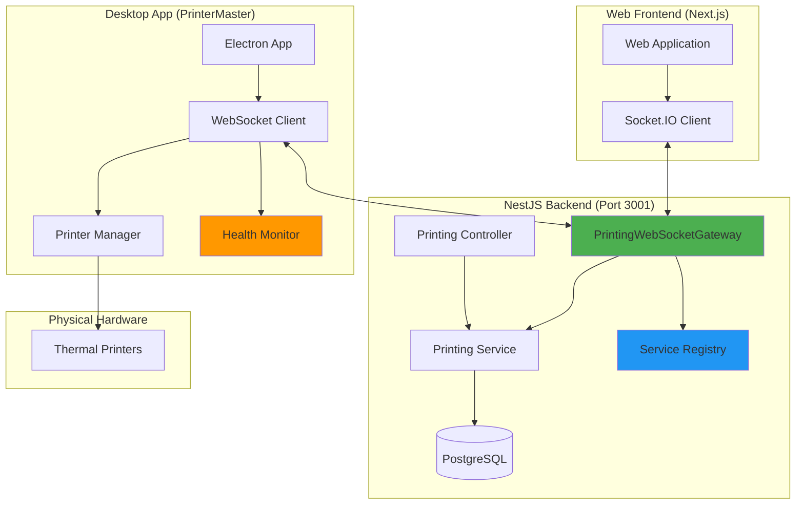
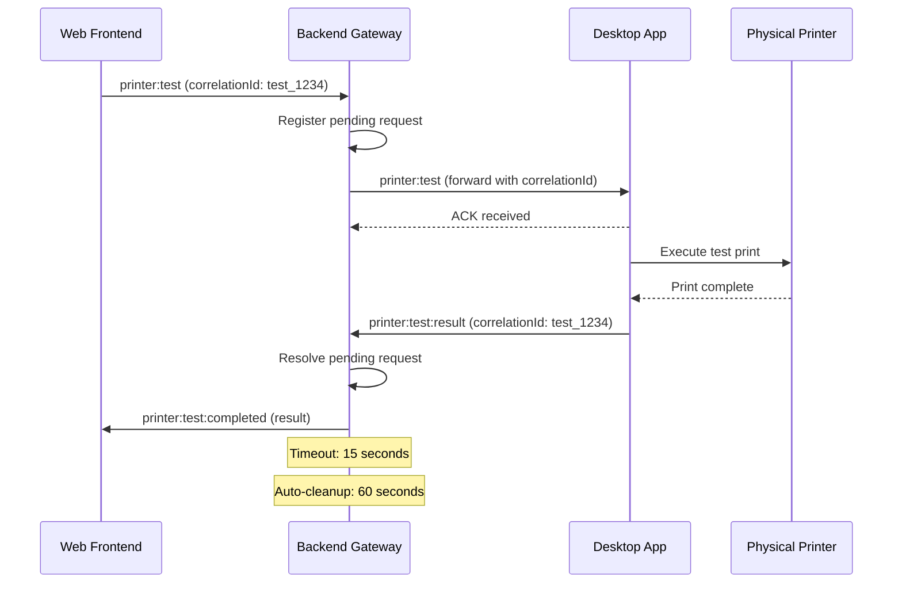
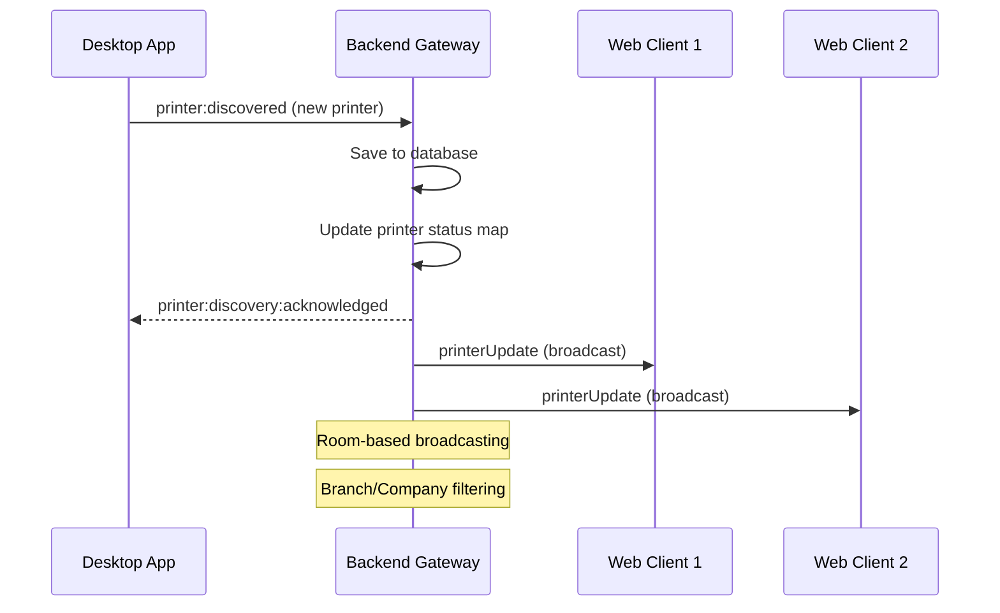
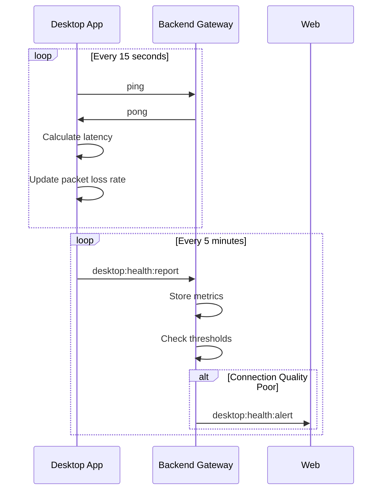
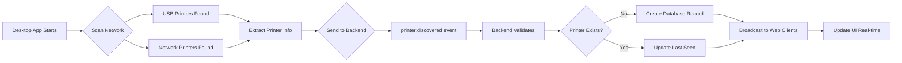
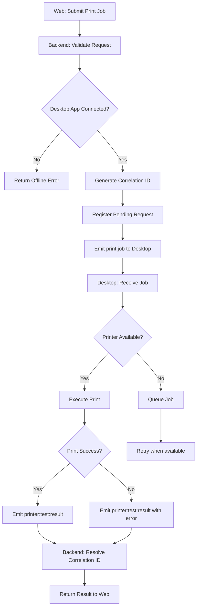
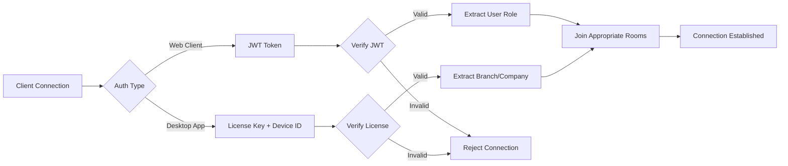
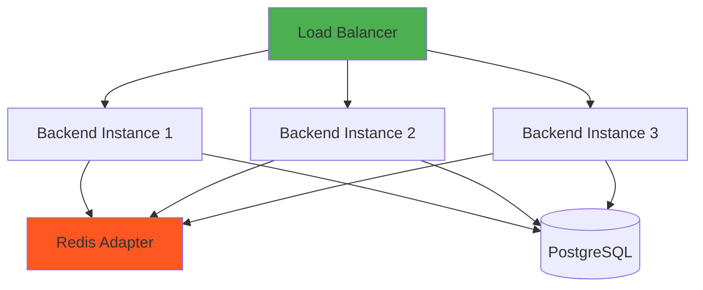

# PrinterMaster WebSocket System Architecture

**Document Version**: 1.0
**Last Updated**: October 7, 2025
**Status**: Production Ready

---

## Table of Contents

1. [System Overview](#system-overview)
2. [Component Architecture](#component-architecture)
3. [Communication Patterns](#communication-patterns)
4. [Data Flow Diagrams](#data-flow-diagrams)
5. [Technology Stack](#technology-stack)
6. [Security Architecture](#security-architecture)
7. [Scalability Considerations](#scalability-considerations)

---

## System Overview

The PrinterMaster WebSocket System provides real-time communication between the NestJS Backend, Desktop Applications (PrinterMaster), and Web Frontend for managing thermal printers in restaurant environments. The system supports bi-directional communication, request-response patterns with correlation IDs, health monitoring, and enterprise-scale multi-tenant operations.

### Key Capabilities

- **Real-time Printer Discovery**: Auto-discovery and registration of network/USB printers
- **Print Job Management**: Queue management, status tracking, completion notifications
- **Health Monitoring**: Connection quality tracking, latency monitoring, packet loss detection
- **Request-Response Pattern**: Correlation ID-based request matching with timeout management
- **Multi-tenant Support**: Company and branch-level data isolation
- **Service Registry**: Dynamic service discovery and load balancing

---

## Component Architecture



### Component Descriptions

#### 1. Web Frontend (Port 3000)
- **Technology**: Next.js 14, React 18, Socket.IO Client
- **Responsibilities**:
  - Printer management UI
  - Real-time status updates
  - Print job submission
  - Health monitoring dashboard

#### 2. NestJS Backend (Port 3001)
- **Technology**: NestJS, Socket.IO Server, Prisma ORM
- **Key Components**:
  - `PrintingWebSocketGateway`: WebSocket event handling
  - `PrintingController`: REST API endpoints
  - `ServiceRegistryService`: Service discovery and registration
  - `PrismaService`: Database operations

#### 3. Desktop App (PrinterMaster)
- **Technology**: Electron, Socket.IO Client
- **Key Components**:
  - `websocket-functions.js`: WebSocket communication
  - `printer-manager.js`: Printer discovery and control
  - `health-monitor.js`: Connection quality tracking

---

## Communication Patterns

### 1. Request-Response Pattern (Correlation IDs)



**Key Features**:
- Unique correlation IDs: `{type}_{timestamp}_{counter}_{random}`
- Timeout management: 15 seconds default
- Acknowledgment callbacks for delivery confirmation
- Automatic cleanup of stale requests

### 2. Event-Driven Broadcasting



### 3. Health Monitoring Heartbeat



---

## Data Flow Diagrams

### Printer Discovery Flow



### Print Job Execution Flow



---

## Technology Stack

### Backend Components

| Component | Technology | Version | Purpose |
|-----------|------------|---------|---------|
| Framework | NestJS | 10.x | Application framework |
| WebSocket | Socket.IO | 4.x | Real-time communication |
| Database | PostgreSQL | 14+ | Data persistence |
| ORM | Prisma | 5.x | Database access layer |
| Authentication | JWT | 9.x | Token-based auth |
| Service Discovery | Bonjour | 3.x | mDNS advertisement |

### Desktop App Components

| Component | Technology | Version | Purpose |
|-----------|------------|---------|---------|
| Runtime | Electron | 25.x | Desktop application |
| WebSocket | Socket.IO Client | 4.x | Backend communication |
| Printer Control | ESC/POS | 3.x | Thermal printer commands |
| USB Interface | Node-USB | 2.x | USB device access |

### Web Frontend Components

| Component | Technology | Version | Purpose |
|-----------|------------|---------|---------|
| Framework | Next.js | 14.x | React framework |
| UI Library | React | 18.x | Component library |
| WebSocket | Socket.IO Client | 4.x | Real-time updates |
| Styling | Tailwind CSS | 3.x | UI styling |

---

## Security Architecture

### Authentication & Authorization



### Multi-tenant Data Isolation

- **Company Level**: All data scoped by `companyId`
- **Branch Level**: Further filtering by `branchId`
- **Room-based Broadcasting**: WebSocket rooms ensure data isolation
  - `company_{companyId}`: All users in a company
  - `branch_{branchId}`: All users in a branch

### Security Controls

1. **Connection Security**:
   - JWT token validation for web clients
   - License key validation for desktop apps
   - Device ID tracking and validation
   - CORS protection with whitelist

2. **Data Security**:
   - Role-based access control (RBAC)
   - Company/branch data filtering
   - Input validation and sanitization
   - SQL injection prevention via Prisma ORM

3. **Communication Security**:
   - Correlation ID validation
   - Request timeout enforcement
   - Rate limiting on endpoints
   - Heartbeat timeout detection

---

## Scalability Considerations

### Horizontal Scaling



**Scaling Strategies**:

1. **WebSocket Scaling**:
   - Redis Adapter for Socket.IO (cross-instance communication)
   - Sticky sessions at load balancer
   - Horizontal pod autoscaling in Kubernetes

2. **Database Scaling**:
   - Read replicas for query distribution
   - Connection pooling (Prisma)
   - Indexed queries for performance

3. **Service Registry Scaling**:
   - Distributed service registry
   - Health check distribution
   - Load balancing across service instances

### Performance Optimization

| Metric | Target | Current | Strategy |
|--------|--------|---------|----------|
| WebSocket Latency | <50ms | ~25ms | Keep-alive optimization |
| Print Request Response | <500ms | ~300ms | Correlation ID caching |
| Database Query Time | <100ms | ~50ms | Strategic indexing |
| Concurrent Connections | 10,000+ | Tested to 1,000 | Connection pooling |
| Message Throughput | 1,000/sec | Tested to 500/sec | Event batching |

---

## System Health Monitoring

### Key Health Metrics

1. **Connection Metrics**:
   - Active WebSocket connections
   - Desktop app uptime
   - Reconnection frequency
   - Average latency

2. **Performance Metrics**:
   - Message processing time
   - Correlation ID resolution time
   - Database query performance
   - Pending request queue depth

3. **Business Metrics**:
   - Print job success rate
   - Printer discovery rate
   - Service availability percentage
   - Error rate by type

### Monitoring Stack

- **Metrics Collection**: Custom health monitoring system
- **Alerting**: WebSocket-based real-time alerts
- **Logging**: Structured logging with correlation ID tracking
- **Dashboards**: REST API endpoints for health data

---

## Deployment Architecture

### Production Environment

```
┌─────────────────────────────────────────┐
│       Load Balancer (31.57.166.18)      │
└─────────────────┬───────────────────────┘
                  │
        ┌─────────┴─────────┐
        │                   │
┌───────▼────────┐  ┌──────▼──────────┐
│ Backend        │  │ Backend         │
│ Instance 1     │  │ Instance 2      │
│ (Port 3001)    │  │ (Port 3002)     │
└───────┬────────┘  └──────┬──────────┘
        │                   │
        └─────────┬─────────┘
                  │
        ┌─────────▼─────────┐
        │   PostgreSQL      │
        │   Database        │
        └───────────────────┘
```

### Deployment Checklist

- [ ] Environment variables configured
- [ ] Database migrations applied
- [ ] SSL certificates installed
- [ ] CORS origins whitelisted
- [ ] Service registry initialized
- [ ] Health monitoring enabled
- [ ] Logging configured
- [ ] Backup strategy verified

---

## Future Architecture Enhancements

### Phase 16+ Roadmap

1. **Message Queue Integration**:
   - RabbitMQ or Kafka for event streaming
   - Guaranteed message delivery
   - Event replay capabilities

2. **Microservices Architecture**:
   - Separate service for printer management
   - Dedicated health monitoring service
   - Independent service registry

3. **Advanced Monitoring**:
   - Prometheus metrics
   - Grafana dashboards
   - Distributed tracing (OpenTelemetry)

4. **Global Distribution**:
   - Multi-region deployment
   - Edge caching with CDN
   - Geographic load balancing

---

**Document Maintained By**: Platform Architecture Team
**Last Review Date**: October 7, 2025
**Next Review Date**: January 7, 2026
